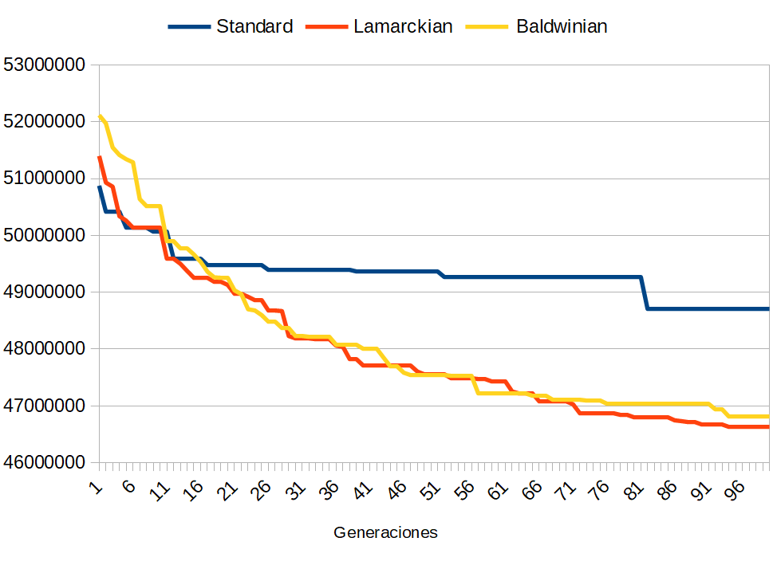

# Solving a Quadratic Assignment Problem using genetic algorithms in Python3

The objective of this practice is to solve a quadratic optimization problem using evolutionary computation techniques. Several variants of evolutionary algorithms have been implemented in order to to solve the problem of quadratic assignment, in addition to a couple of optimization techniques.

* [Documentation](doc/documentation.pdf)

## Comparation between all three algoritms



* **Number of generation.** 100
* **Population size.** 60
* **Maximun number of repetition of the best individual.** 20
* **Individual mutation probability.** 50%
* **Chromosome mutation probability.** 5%

## Execution output


## Results

Currently, the best results has been obtained using the **lamarckian algorithm**. It has a fitness of `46634000` and its chromosomes are

```
[169, 56, 148, 224, 235, 32, 12, 250, 103, 243, 50, 65, 150, 192, 60, 254, 214, 147, 255, 173, 95, 241, 76, 45, 137, 26, 191, 167, 126, 84, 248, 125, 101, 201, 186, 58, 245, 199, 88, 4, 17, 228, 107, 178, 0, 180, 197, 226, 23, 31, 53, 156, 110, 62, 217, 68, 105, 122, 203, 188, 206, 81, 161, 189, 253, 54, 159, 165, 129, 93, 231, 51, 18, 43, 130, 135, 212, 116, 154, 72, 112, 86, 21, 160, 221, 9, 90, 118, 98, 79, 184, 193, 213, 215, 5, 89, 66, 113, 70, 82, 151, 67, 171, 209, 97, 227, 195, 142, 102, 205, 20, 219, 111, 61, 237, 96, 52, 49, 174, 7, 211, 37, 69, 64, 104, 223, 55, 15, 200, 41, 247, 157, 119, 74, 39, 35, 181, 216, 220, 128, 27, 6, 106, 11, 34, 141, 179, 83, 131, 204, 230, 194, 40, 145, 138, 46, 77, 59, 10, 28, 225, 244, 120, 187, 190, 149, 71, 196, 42, 123, 182, 47, 172, 152, 121, 124, 198, 36, 94, 78, 164, 99, 146, 218, 24, 87, 117, 13, 44, 249, 108, 14, 239, 242, 234, 33, 85, 163, 1, 238, 75, 8, 251, 38, 166, 229, 185, 127, 240, 162, 202, 3, 233, 246, 144, 73, 236, 133, 153, 57, 30, 155, 177, 115, 140, 222, 183, 109, 100, 176, 19, 16, 232, 158, 168, 207, 134, 63, 208, 136, 29, 132, 170, 252, 92, 91, 48, 2, 210, 143, 175, 114, 80, 139, 22, 25]
```
